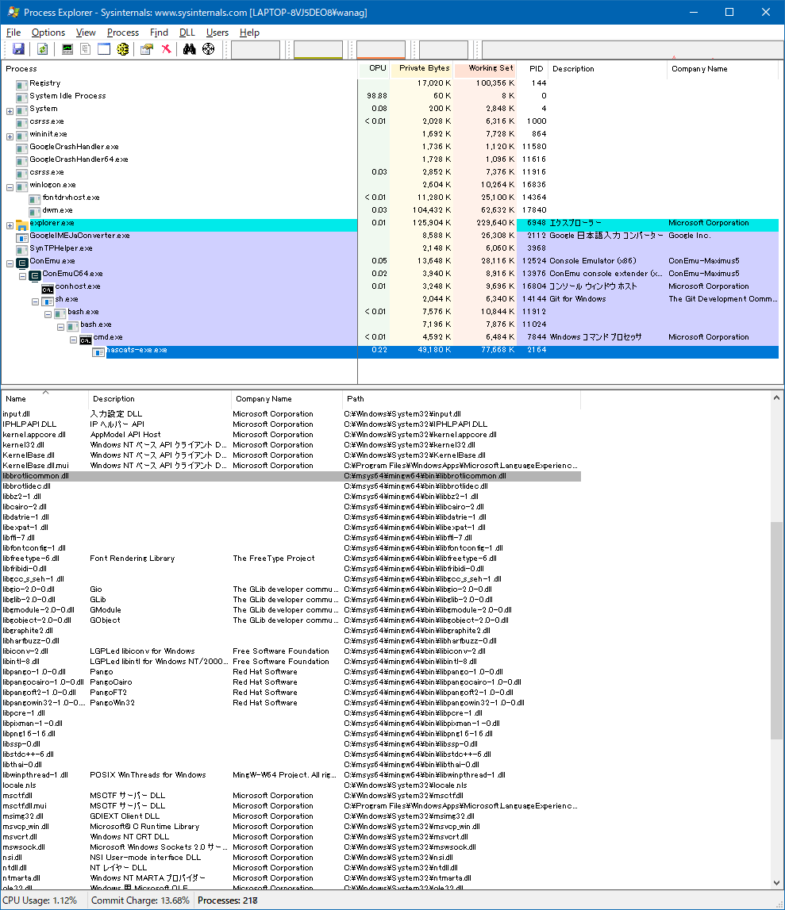

# Windowsの設定

## Networkの設定

いつもどおりIPアドレスを設定する。

## インストーラーの作成とインストール

### 実行体、DLLの準備

実行体(e.g., `C:\Users\wanag\AppData\Roaming\local\bin\hascats-exe.exe`)
を`assets\`下に置く。

開発用のPCで`stack exec hascats-exe`などで`hascats-exe`を起動しておいて、

[Process Explorer](https://docs.microsoft.com/en-us/sysinternals/downloads/process-explorer)
のView->Lower Pane View->DLLsで依存しているDLLを探す。

{#fig:process-explorer}

見つけたDLLを全部`assets\`下に置く。
（`C:\Windows`下のDLLはWindowsのDLLなので必要ない）

できれば`icon.ico`も作成して`assets\`下に置いておく。

### installer.nsiのコンパイル

[NSIS](https://nsis.sourceforge.io/Main_Page)
をインストールして、`installer.nsi`を右クリックしてCompile NSIS Scriptをクリック。

コンパイルに成功すればインストーラ`hascats-installer.exe`が生成される。

# 参考

[Reference](https://blog.patchgirl.io/haskell/2020/10/30/windows-installer-for-haskell-software.html)
